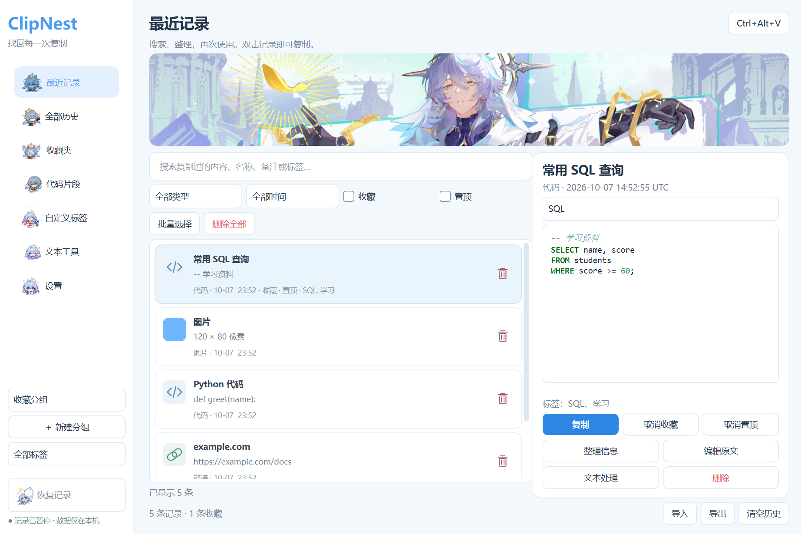
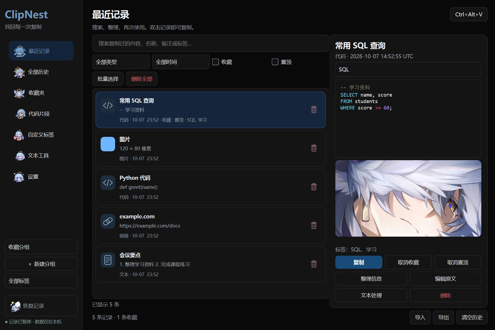
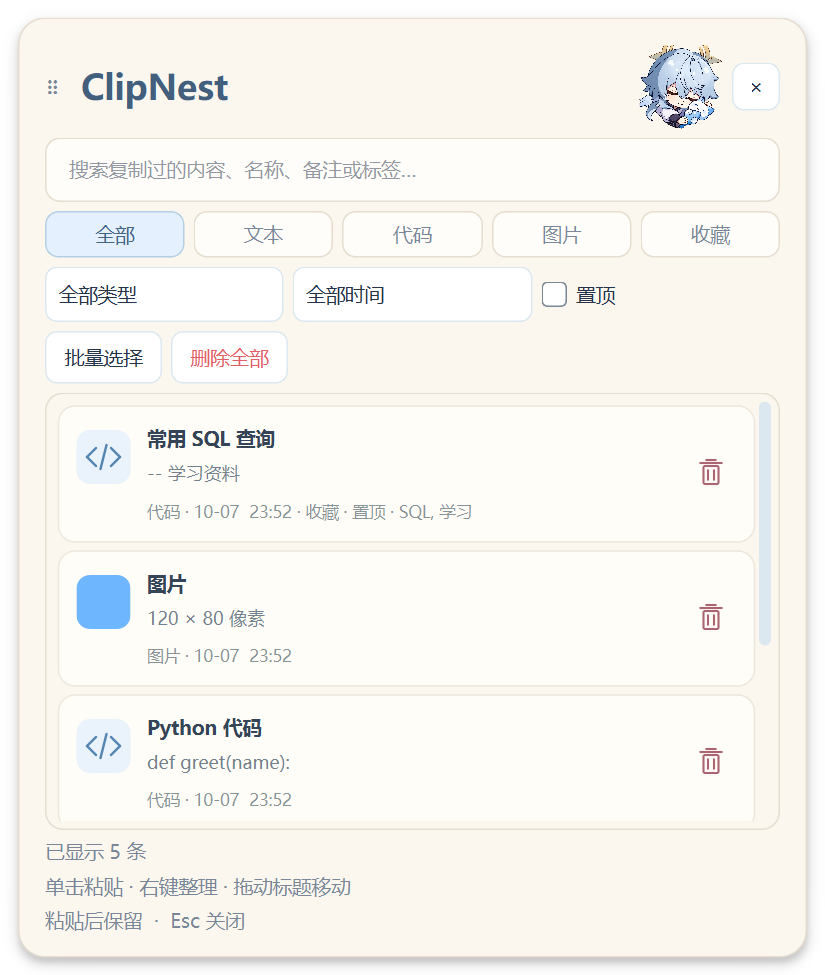

# ClipNest 电脑剪贴板 星期日UI和原版UI两个版本

ClipNest 是一个 Windows 本地剪贴板管理器。它保存新复制的文本、代码、链接和图片，支持搜索、收藏、置顶、标签和再次复制。默认快捷键是 `Ctrl + Alt + V`，用来打开快捷浮窗。

## 下载与版本

两个版本放在同一个仓库，分别保留源码标签和下载包。

| 版本 | 界面 | 下载与源码 |
| --- | --- | --- |
| **v0.2.0 新版** | 插画主题，冰蓝浅色主窗口、黑色主窗口、暖白快捷浮窗 | [下载新版](https://github.com/ononsunday/ClipNest/releases/tag/v0.2.0) · [新版源码](https://github.com/ononsunday/ClipNest/tree/v0.2.0) |
| v0.1.0 旧版 | 原版界面 | [下载旧版](https://github.com/ononsunday/ClipNest/releases/tag/v0.1.0) · [旧版源码](https://github.com/ononsunday/ClipNest/tree/v0.1.0) |

下载新版中的 `ClipNest-v0.2.0-Windows-x64.zip`，完整解压，再双击 `ClipNest.exe`。需要保留 `_internal` 文件夹；程序无需另外安装 Python。这是便携目录版，不是安装器。

升级前从托盘菜单完全退出旧版。把新版解压到另一个文件夹，可保留两套程序，但日常使用只运行其中一套。两版默认使用同一个本地数据目录；升级前请退出程序并备份整个 `%LOCALAPPDATA%\ClipNest` 文件夹。新版没有新增数据库格式，回退到旧版前也建议保留备份。

## 新版截图

以下图片来自新版打包程序在 Windows 上的实际运行，列表内容是专门生成的示例数据。

### 浅色管理窗口

左侧选择历史、收藏或代码片段，中间查找记录，右侧查看原文并复制、收藏、置顶或整理信息。



### 黑色管理窗口

黑色背景配合深蓝选中状态，插画显示在详情区。查看图片记录时，装饰插画会隐藏。



### 暖白快捷浮窗

按 `Ctrl + Alt + V` 呼出，搜索或按类型筛选。点击记录会复制内容并尝试粘贴到原来的输入框；如果目标软件无法自动粘贴，可以自行按 `Ctrl + V`。



## 第一次使用

1. 双击 `ClipNest.exe`，复制一段文字，例如“今天的学习笔记”。
2. 按 `Ctrl + Alt + V`，在列表中找到这段文字。
3. 打开记事本，把光标放进输入框，再呼出快捷浮窗并点击这条记录。
4. 需要长期保留的内容，可以收藏或置顶；需要完整管理时打开主窗口。

关闭主窗口后，程序默认留在托盘。要完全退出，请使用托盘菜单。快捷浮窗默认在发送粘贴后继续显示，可在设置中开启“粘贴后自动关闭快捷浮窗”。

## 功能

- 文本、代码、链接、邮箱、颜色和图片历史；相同内容重复复制时更新使用时间。
- 即时搜索、类型筛选、收藏、置顶、自定义标签和分组。
- 原文编辑，代码预览保留缩进与换行。
- 去空格、清理换行、大小写转换、去重行和 JSON 格式化；先预览结果，再复制或保存。
- 导入、导出、批量删除和自动清理；收藏、置顶记录受到保护。
- 浅色、深色主题，托盘暂停监听，排除应用和快捷键设置。

## 数据与隐私

数据保存在 `%LOCALAPPDATA%\ClipNest`。应用不需要账号，没有服务器、遥测或在线 AI 功能。启动时不读取剪贴板已有内容，只记录开始监听后的新复制内容。

历史数据库和导出文件包含复制过的原文及图片，目前没有数据库加密。复制密码、验证码等敏感内容前，请暂停记录；排除应用功能不能保证识别所有敏感内容。发布包和截图不包含个人剪贴板数据库。

## 从源码运行

需要 Windows 10/11、Python 3.12 或更新版本。在仓库根目录打开 PowerShell：

```powershell
Set-Location .\源码
py -3.12 -m venv .venv
.\.venv\Scripts\python.exe -m pip install -r requirements.txt
powershell -NoProfile -ExecutionPolicy Bypass -File .\scripts\run.ps1
```

应用、测试、构建脚本都在 [`源码`](源码/) 目录。详细操作见[源码说明](源码/README.md)，测试及兼容性限制见[发布与验收说明](源码/docs/RELEASE.md)。

## 素材与许可

主题中包含《崩坏：星穹铁道》相关图片及参考图制作的透明素材。项目维护者已确认具有本次公开分发所需的授权。角色及原画权利属于各自权利人，这不表示第三方可任意使用这些图片。来源记录见[素材说明](源码/clipnest/assets/ATTRIBUTION.md)。

ClipNest 自身尚未指定开源许可证。源码可以公开查看，但公开仓库本身不授予修改或再分发许可。依赖组件分别遵循各自许可证，见[第三方组件说明](源码/docs/licenses/THIRD_PARTY_NOTICES.md)。
